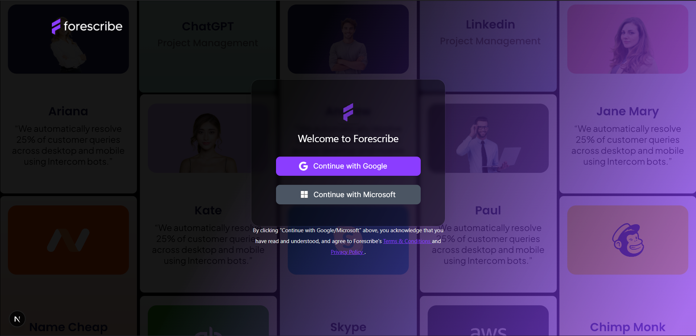

# Forescribe — Frontend Assignment (Next.js + TypeScript + Tailwind)


An implementation of the provided Figma screen using **Next.js (App Router)**, **TypeScript**, and **Tailwind CSS**.


## 🚀 Live Demo
**URL:** https://YOUR-VERCEL-URL.vercel.app


## 🧱 Tech Stack
- Next.js (App Router)
- TypeScript
- Tailwind CSS
- Framer Motion


## 🛠️ Getting Started

First, run the development server:

```bash
# 1) Install deps
npm install


# 2) Start dev server
npm run dev
# http://localhost:3000


# 3) Type-check (optional)
npm run typecheck


# 4) Build & start
npm run build && npm run start


Open [http://localhost:3000](http://localhost:3000) with your browser to see the result.


📸 Screenshot




🔗 Submission

GitHub Repo: https://github.com/JoshuaStefen/forescribe-frontend

Live Demo on Vercel: https://forescribe-frontend-git-main-joshua-ss-projects-6ab2360a.vercel.app?_vercel_share=dSEFZpbKqGkYa65lSOADM39qnFbqOnEj
